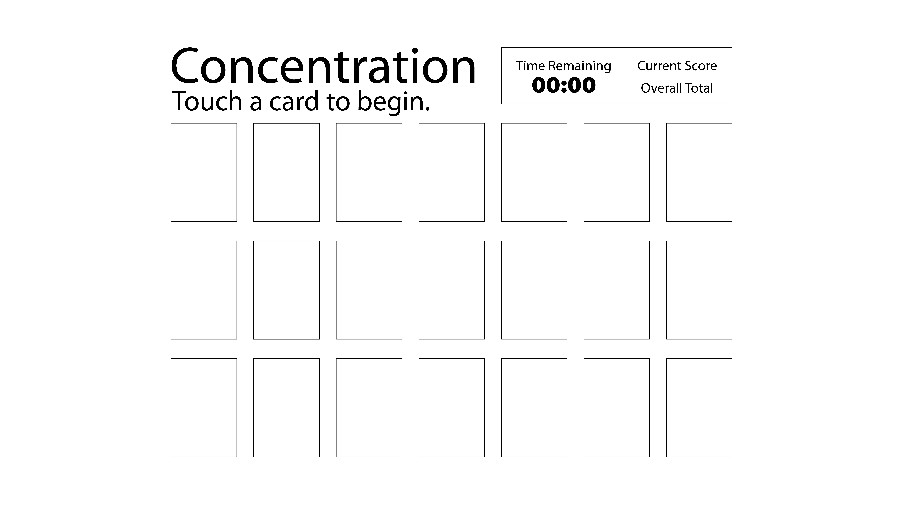

# Planning
## Choice of Game: Concentration
Wireframe: 

## User Stories:
- On page load, there's a grid of cards, and a score area with a timer. Instructions say touch a card to begin.
- Touching a card causes that card to flip, displaying a certain graphic. That card stays flipped until the user touches another card.
- Touching a second card causes it to flip, and if the 2 flipped cards match, they stay flipped until the game is over.
- The user keeps flipping cards until they either run out of time or all the pairs of cards are revealed.
## MVP:
- A grid of clickable card images that turn
- A working game that compares cards and decides if the user picked matching cards
- A scoring display
- A timer that shows time remaining
## Future Features:
- Making matches gradually reveals a large image beneath the board.
- The user can choose the size of the board. (How many rows/columns)
- There's a start button that when clicked, it makes all the cards flip, and they stay flipped for 5 seconds, then the turn back to their original state, and the timer starts running down.
